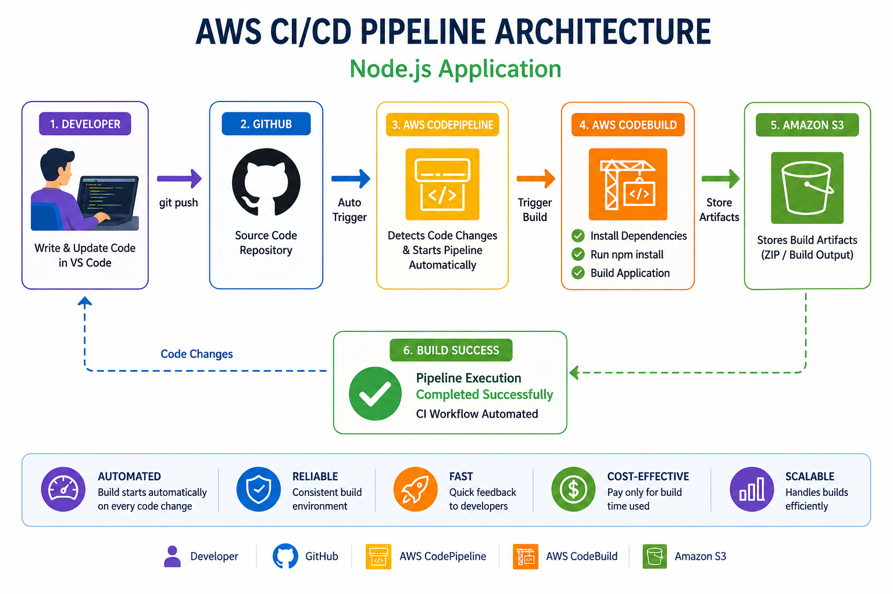
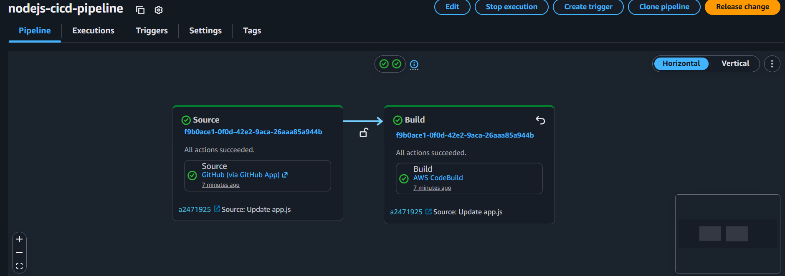
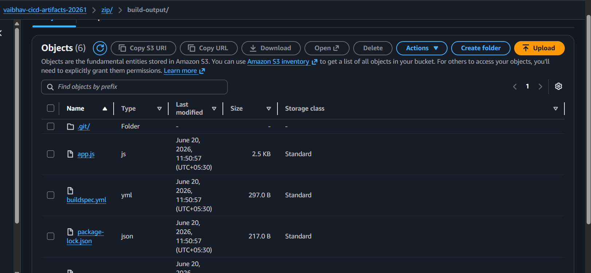
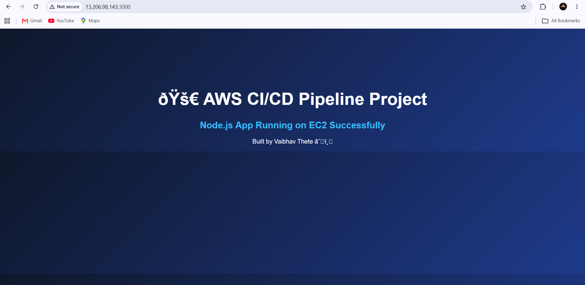

# 🚀 AWS CI/CD Pipeline for Node.js Application using CodePipeline & CodeBuild


---

# 🌍 Project Overview

Modern software development requires **fast delivery, automation, and continuous integration**.

In traditional development workflows, developers manually build and test applications after every code change, which becomes time-consuming and inefficient.

To understand real-world DevOps workflow, I built a **CI/CD Pipeline on AWS** that automatically detects code changes pushed to GitHub, triggers an automated build process using AWS services, and stores build artifacts in Amazon S3.

This project helped me understand how modern companies automate software delivery using cloud-native DevOps services.

The project integrates **GitHub, AWS CodePipeline, AWS CodeBuild, Amazon S3, EC2, and Node.js** to create an automated build workflow.

---

# ❗ Problem Statement

Traditional deployment workflow has multiple challenges:

❌ Manual build process after every code change
❌ Repetitive developer effort
❌ Higher chance of deployment errors
❌ Slow software delivery cycle
❌ No automation between code updates and build process

### Proposed Solution

Build an automated cloud pipeline that can:

✅ Detect code changes automatically
✅ Trigger build process without manual effort
✅ Install dependencies automatically
✅ Build application automatically
✅ Store artifacts in cloud storage
✅ Create scalable DevOps workflow

---

# 🏗️ Architecture Diagram



---

# ⚙️ Complete System Architecture Flow

```text
Developer (VS Code)
        │
        ▼
GitHub Repository
        │
        ▼
AWS CodePipeline
        │
        ▼
AWS CodeBuild
        │
        ▼
Amazon S3 Artifact Storage
        │
        ▼
Build Success
```

---

# 📸 Project Screenshots


## 🔄 AWS CodePipeline Success



---

## ⚙️ AWS CodeBuild Success


---

## 🪣 Amazon S3 Artifact Storage



---

## 💻 Local Node.js Application Running



---

# ☁️ AWS Services Used

### 1. GitHub Repository

GitHub was used as source code repository.

Purpose:

• Store project source code
• Detect code changes
• Trigger pipeline automatically

---

### 2. AWS CodePipeline

AWS CodePipeline manages complete CI/CD workflow.

Responsibilities:

• Monitor GitHub repository
• Detect code changes automatically
• Trigger CodeBuild process

Benefits:

• Full build automation
• Faster software delivery

---

### 3. AWS CodeBuild

CodeBuild automatically builds the application.

Responsibilities:

• Pull source code
• Install Node.js dependencies
• Execute build process
• Generate build output

Build command:

```bash
npm install
```

---

### 4. Amazon S3

Amazon S3 stores build artifacts generated after successful build.

Purpose:

• Store ZIP build output
• Maintain build artifacts
• Integrate with pipeline

---

### 5. Amazon EC2

Used for application testing.

Purpose:

• Run Node.js application manually
• Verify project locally

---

# 🔄 Project Workflow

### Step 1

Developer writes Node.js application in VS Code.

---

### Step 2

Code pushed to GitHub repository.

Command:

```bash
git push origin main
```

---

### Step 3

AWS CodePipeline automatically detects code change.

---

### Step 4

CodePipeline triggers AWS CodeBuild.

---

### Step 5

CodeBuild reads build instructions from:

```text
buildspec.yml
```

---

### Step 6

AWS installs Node.js runtime automatically.

---

### Step 7

Build process executes:

```bash
npm install
```

---

### Step 8

Application build completes successfully.

---

### Step 9

Build artifacts stored inside Amazon S3 bucket.

---

### Step 10

Pipeline execution shows successful build completion.

---

# 📄 Important Project Files

### app.js

Node.js application source code.

---

### package.json

Stores project metadata and dependencies.

---

### buildspec.yml

Contains build instructions for AWS CodeBuild.

Example:

```yaml
version: 0.2

phases:
  install:
    runtime-versions:
      nodejs: 20

  build:
    commands:
      - npm install

artifacts:
  files:
    - '**/*'
```

---

# 🎯 Key Features

✅ Automatic Build Trigger on Git Push
✅ AWS CodePipeline Integration
✅ Automated Build using CodeBuild
✅ Build Artifact Storage in S3
✅ Cloud-Based DevOps Workflow
✅ Zero Manual Build Process
✅ Faster Development Workflow

---

# ⚠️ Challenges Faced During Development

During implementation I solved:

• GitHub integration issues
• IAM role permission configuration
• CodeBuild runtime errors
• buildspec.yml syntax errors
• S3 artifact bucket configuration
• AWS pipeline execution debugging

This project improved my DevOps troubleshooting skills.

---

# 📚 Skills Learned

Through this project I learned:

✅ AWS CodePipeline
✅ AWS CodeBuild
✅ Amazon S3
✅ GitHub Integration
✅ Node.js Application Deployment
✅ Build Automation
✅ DevOps Workflow
✅ CI/CD Pipeline Architecture
✅ Cloud Automation

---

# 🌍 Real World Use Cases

This workflow is widely used in:

• Enterprise Web Applications
• SaaS Products
• Cloud Native Applications
• Microservices Deployment
• DevOps Automation Systems
• Production Build Pipelines

Companies using similar systems:

• Amazon
• Netflix
• Google
• Microsoft
• Uber

---

# 🚀 Future Improvements

Can be improved by adding:

• Automatic deployment to EC2
• Docker container deployment
• ECS deployment
• CodeDeploy integration
• Blue-Green deployment strategy
• Monitoring using CloudWatch

---

# 🛠️ Tech Stack

Node.js • GitHub • AWS CodePipeline • AWS CodeBuild • Amazon S3 • AWS IAM • Amazon EC2 • DevOps • CI/CD

---

# 📊 Project Outcome

Successfully built a cloud-native CI/CD pipeline.

Achievements:

✔ Automated Build Trigger
✔ GitHub Integration
✔ Cloud Build Automation
✔ Artifact Storage in S3
✔ DevOps Workflow Implementation
✔ Real AWS Service Integration

---

# 👨‍💻 Author

**Vaibhav Thete**

GitHub:
https://github.com/Vaibhavthete12

LinkedIn:
https://www.linkedin.com/in/vaibhav-thete-b27734301/

---

# 🎉 Final Conclusion

This project helped me understand how modern software companies automate application delivery using **DevOps practices and AWS cloud services**.

By integrating **GitHub, AWS CodePipeline, AWS CodeBuild, Amazon S3, and Node.js**, I built a complete CI/CD workflow demonstrating practical knowledge of:

**DevOps + Cloud Automation + Continuous Integration + AWS Developer Tools**

This project strengthened my understanding of real-world DevOps engineering practices.

---

⭐ If you found this project useful, feel free to star the repository.
